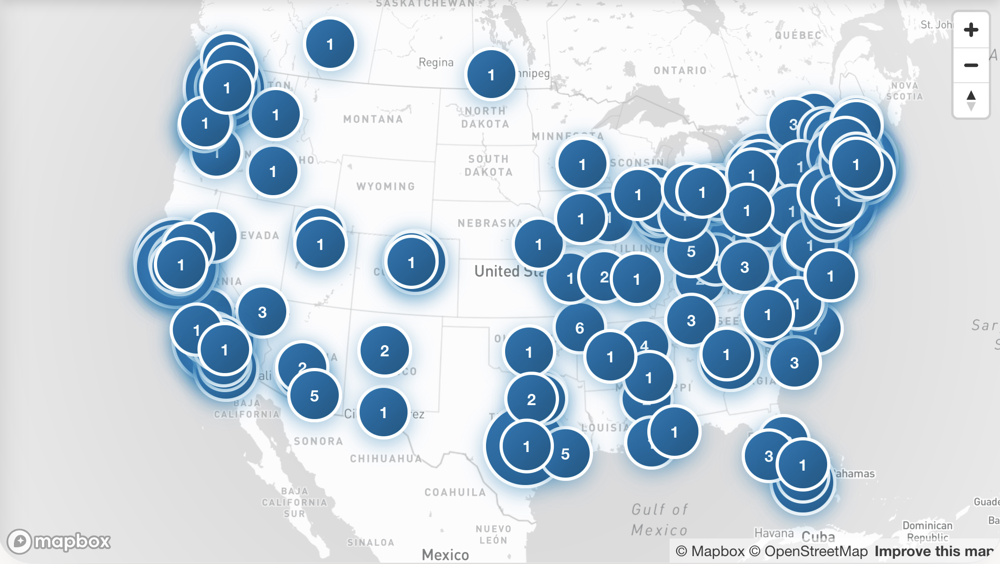

# Hello Again 👏



**Hello Again** maps your LinkedIn connections so you can reconnect with people near you.

Hello Again leverages LinkedIn's [Download Your Data](https://www.linkedin.com/comm/psettings/member-data) and OpenAI Batch to affordably identify the location of your connections, giving you a powerful new way to discover and connect. Data is rendered using MapBox.

* **Privacy by Design**. Hello Again stores all data in _your_ browser. No web server
* **Acceptable Use**. Hello Again doesn't scrape LinkedIn or leverage forbidden extensions
* **Free & Open Source**. Hello Again is completely free and open source

## The Process

1. Visit LinkedIn [Download Your Data](https://www.linkedin.com/comm/psettings/member-data)
2. Click "Request new archive"
3. Wait for the email from LinkedIn
   1. "The first installment of your LinkedIn data archive is ready!"
4. Download the ZIP file of your LinkedIn data
5. Upload the ZIP file to TODO
   1. This creates an OpenAI Batch request to fetch public location data

## Getting Started

First, run the development server:

```bash
npm run dev
# or
yarn dev
# or
pnpm dev
# or
bun dev
```

Open [http://localhost:3000](http://localhost:3000) with your browser to see the result.

You can start editing the page by modifying `app/page.tsx`. The page auto-updates as you edit the file.

This project uses [`next/font`](https://nextjs.org/docs/app/building-your-application/optimizing/fonts) to automatically optimize and load [Geist](https://vercel.com/font), a new font family for Vercel.

## Learn More

To learn more about Next.js, take a look at the following resources:

- [Next.js Documentation](https://nextjs.org/docs) - learn about Next.js features and API.
- [Learn Next.js](https://nextjs.org/learn) - an interactive Next.js tutorial.

You can check out [the Next.js GitHub repository](https://github.com/vercel/next.js) - your feedback and contributions are welcome!

## Deploy on Vercel

The easiest way to deploy your Next.js app is to use the [Vercel Platform](https://vercel.com/new?utm_medium=default-template&filter=next.js&utm_source=create-next-app&utm_campaign=create-next-app-readme) from the creators of Next.js.

Check out our [Next.js deployment documentation](https://nextjs.org/docs/app/building-your-application/deploying) for more details.
